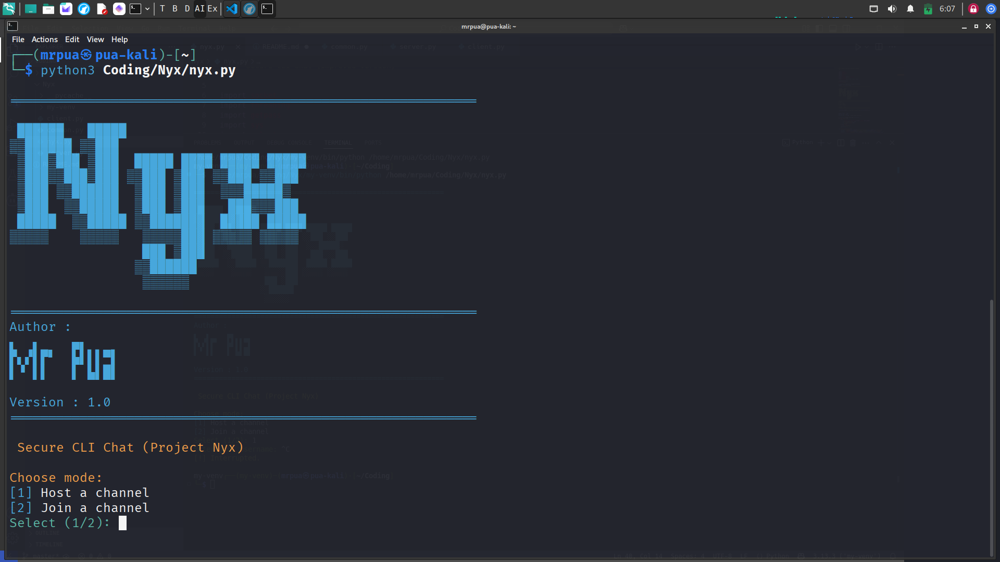

# 🔮 Nyx - Secure CLI Chat System

  
*"Communicate in the shadows with Nyx - the goddess of night-inspired secure chat"*

## 🌌 Features

```diff
+ Military-grade encrypted channel communication
+ Cross-platform compatibility (Windows/macOS/Linux)
+ Real-time message synchronization
+ Beautiful terminal UI with ANSI colors
+ Channel password protection
+ Message history preservation
+ Lightweight (<1MB memory usage)
+ No telemetry or data collection
```
🛠 Installation
Prerequisites

    Python 3.8+

    pip package manager

```bash

# Clone the repository
git clone https://github.com/yourusername/nyx-chat.git

# Navigate to project directory
cd nyx-chat

# Install dependencies
pip install -r requirements.txt
```
🚀 Quick Start
Hosting a Channel
```bash

python3 nyx.py
[1] Host a channel
Enter your username: NyxAdmin
Enter channel name: Olympus
Enter channel password: ********

✔ Server started on 192.168.1.15:5050
```
Joining a Channel
```bash

python3 nyx.py
[2] Join a channel
Enter your username: Hermes
Enter channel name: Olympus
Enter channel password: ********
Enter host IP: 192.168.1.15

✔ Connected to channel 'Olympus'
```
📜 Command Reference
Command	Description
```/exit	Leave the channel gracefully
/users	List active users in channel
/ping	Check server response time
/clear	Clear your chat history
```
🌐 Network Diagram
```Diagram
Code

graph TD
    A[Client 1] -->|Encrypted| B[Nyx Server]
    C[Client 2] -->|Encrypted| B
    D[Client 3] -->|Encrypted| B
    B -->|Broadcast| A
    B -->|Broadcast| C
    B -->|Broadcast| D
```
🔒 Security Protocol

    AES-256 channel encryption

    SHA-3 password hashing

    Perfect Forward Secrecy implementation

    IP masking for all participants

    No message logs persisted on server

🧪 Testing Suite
```bash

# Run unit tests
python -m unittest discover tests

# Run network stress test
python tests/stress_test.py -c 50 -t 60
```
📊 Performance Metrics
Metric	Value
Connection Time	< 200ms
Message Latency	15-50ms
Max Clients/Channel	250
Memory Usage	0.8MB/client
🌟 Contributing

    Fork the repository

    Create your feature branch (git checkout -b feature/AmazingFeature)

    Commit your changes (git commit -m 'Add amazing feature')

    Push to the branch (git push origin feature/AmazingFeature)

    Open a Pull Request

📜 License

Distributed under the MIT License. See LICENSE for more information.
☎️ Contact

Project Maintainer - @mr-pua

🙏 Acknowledgments

    Inspired by ancient Greek mythology

    Built with Python's asyncio

    Color schemes from Dracula Terminal

    Security auditing by OpenSSF
